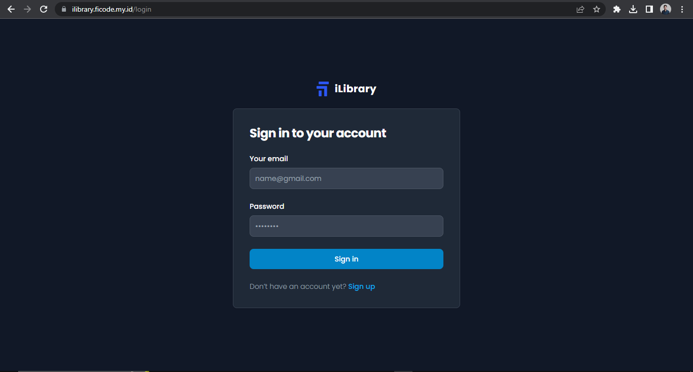
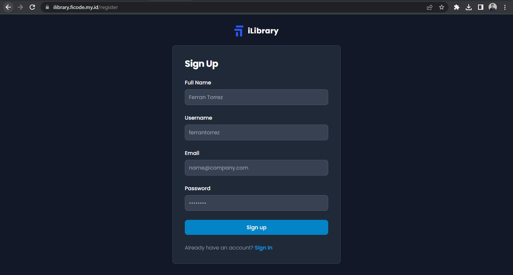
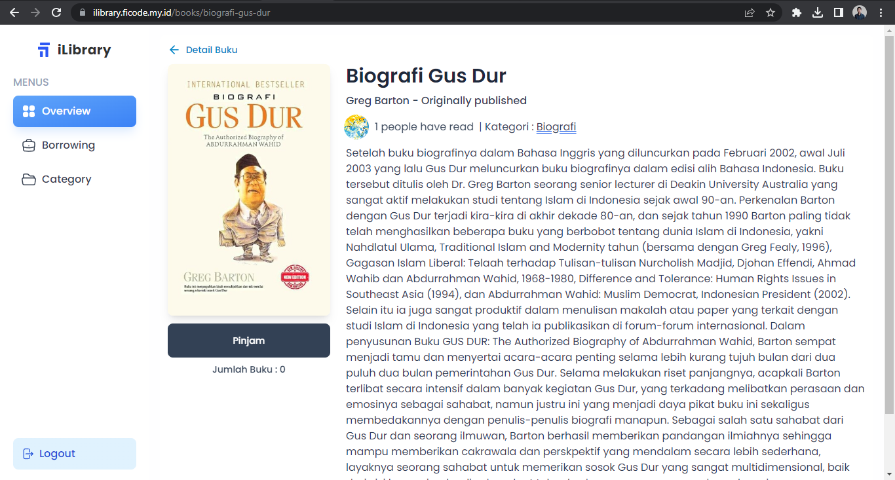
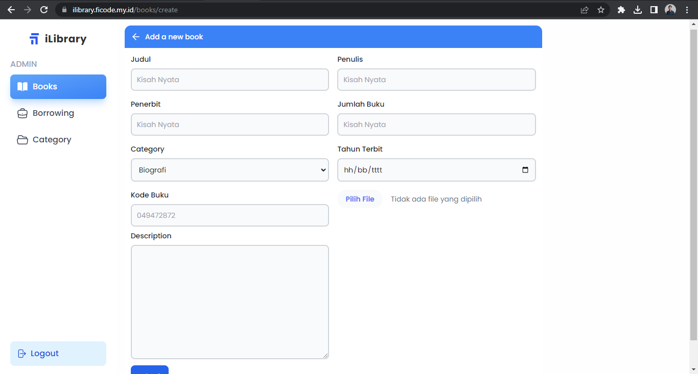
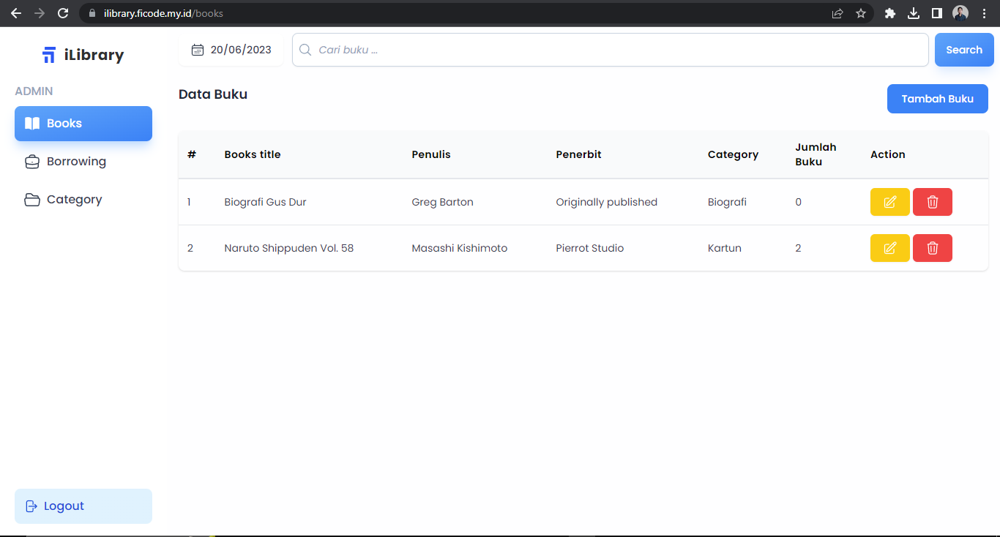
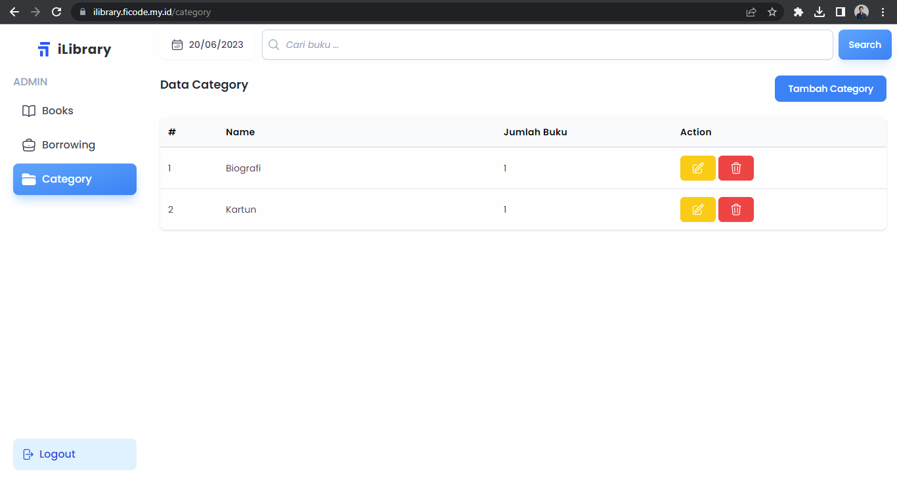
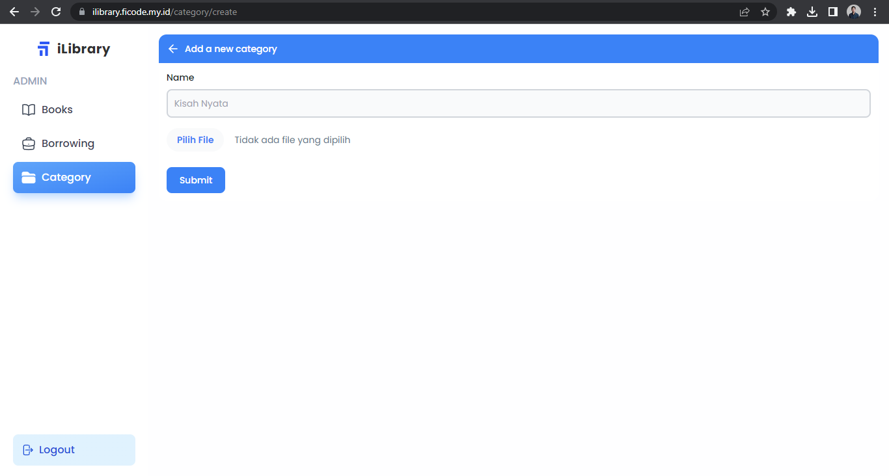
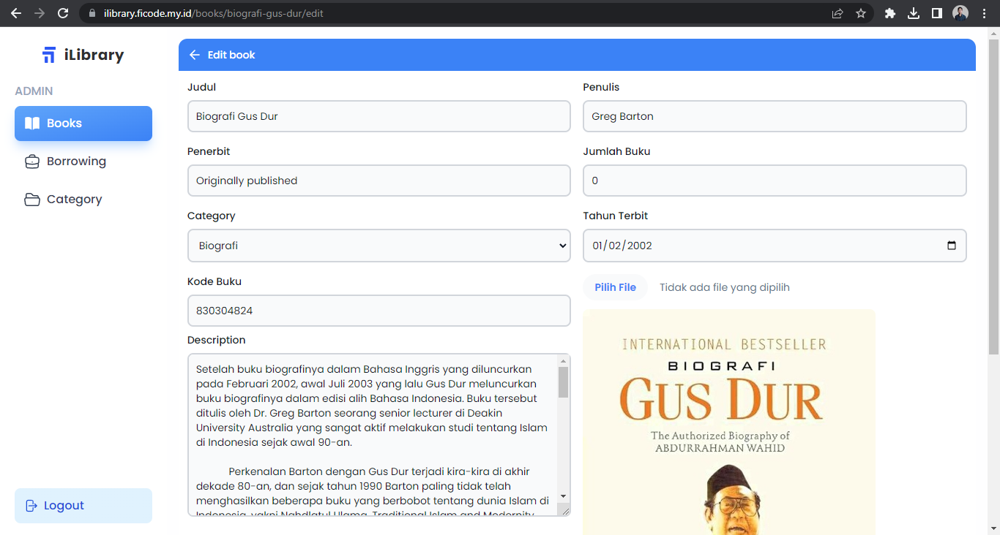
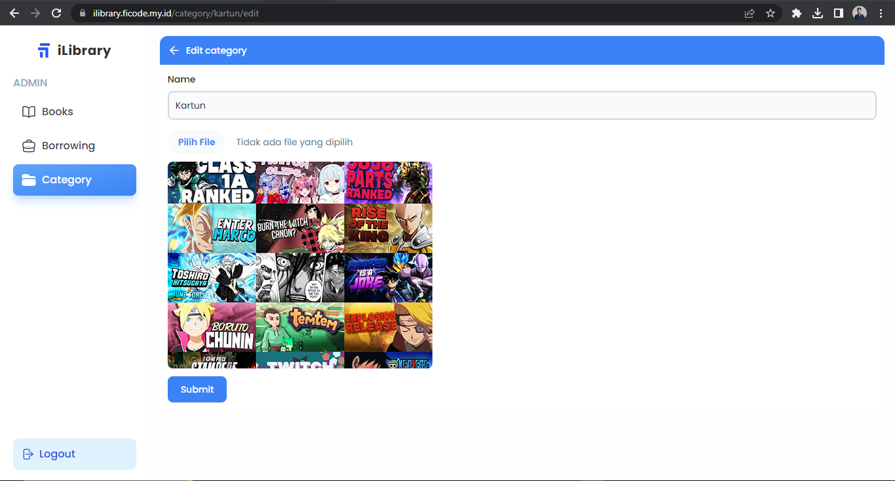
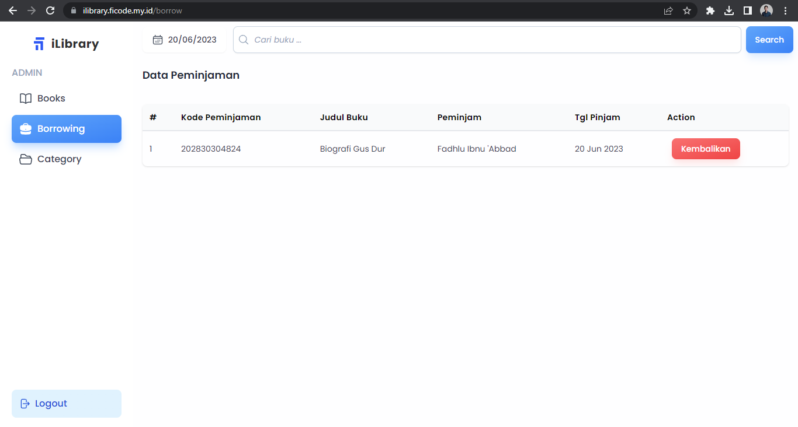

# SIPERPUS :books: :office:

Sistem Informasi Perpustakaan (SIPERPUS) saya buat untuk memudahkan para pegawai dalam manajemen buku, transaksi peminjaman dan manajemen anggota. 

## Teknologi dan Tool yang digunakan :alien:

-   Laravel 5.8
-   Spatie
-   CKeditor
-   etc

## Screenshot Beberapa Tampilan dan Fitur Website :camera:

1. Homepage

    

2. Katalog Buku

    

3. Detail Buku

    

4. Pengumuman dan Informasi

    

5. Detail Pengumuman & Informasi

    

6. Dashboard Pegawai

    

7. Manajemen Buku

    

8. Tambah Pengumuman (CKEditor)

    

9. Manajemen Peminjaman & Pengembalian

    

10. Manajemen Pegawai (2 User Pegawai Biasa & Admin)

    

---

## License 🌌

-   Copyright © 2025 Aslam Mardin

---

**Made with ❤️ by Aslam Mardin**